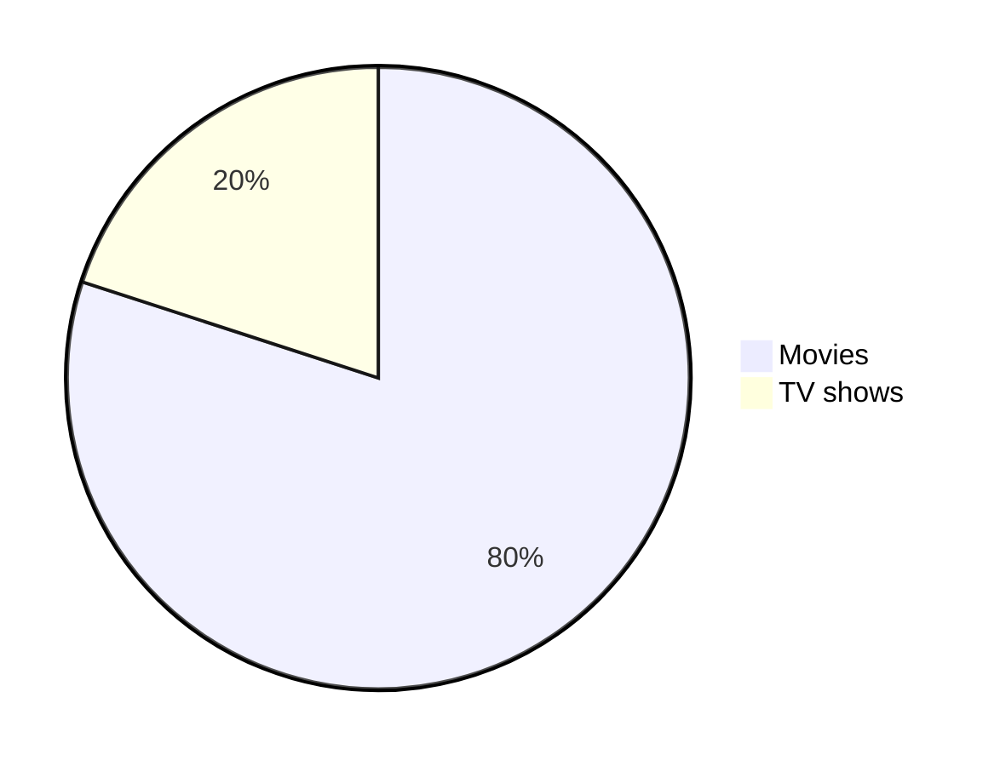

# 4. Fixing the Vulnerabilities
___
### following are few more vulnerabilities that I found in the zoobar application and how I fixed them

#### 1. Login attempts are not limited:
###### **vulnerability:**
a Login attempts are not limited, so an attacker can try to brute force the password of a user
###### **fix:** 
limit the number of login attempts to 5 attempts per 2 minutes and block the user for 2 minutes if the user exceeded the limit


###### **implementation:**
* created new table in the database named failed_logins which store the number of login attempts and the time of the last login attempt for each user.
<ul style="width: 80%; ">
  <li>
Add new table in the database named failed_logins which store the number of login attempts and the time of the last login attempt for each user.
  </li>
  <br>
  <li>
  Modify the "checkLogin" function in login.py file which check if the user exceeded the limit before actually trying to log in the user.
  if the user exceeded the limit, the user will be blocked for 2 minutes and the user will be able to login again after 2 minutes.
  if the user didn't exceed the limit, and the login failed, a new record will be added to the failed_logins table with the time of the 
  last login attempt for the user 
  if the user didn't exceed the limit, and the login succeeded, the records for the user will be deleted from the failed_logins table.
  </li>
</ul>


```python
    def checkLogin(self, username, password, blocking_duration_minutes=2, max_attempts=5):
        now = datetime.now()
        cred = Cred.get_by_username(username)
        if cred is None:
            return None
        # Get all failed attempts that happened in the last blocking_duration_minutes minutes
        attempts = FailedLogin.get_failed_attempts(cred, now, blocking_duration_minutes)
        if len(attempts) >= max_attempts:  # Too many failed attempts
            time_left = get_remaining_time(attempts, now, blocking_duration_minutes)
            login_error = "Too many failed attempts. Try again in %s:%s" % (
                time_left.seconds // 60, time_left.seconds % 60)
            log(login_error)
            return login_error
        # Check credentials

        token = auth_client.login(username, password)
        if token is not None:  # Successful login
            # Clear failed attempts
            FailedLogin.delete_failed_attempts(attempts)
            return self.loginCookie(username, token)
        else:  # Failed login
            FailedLogin.add_failed_attempt(cred)  # Log failure to failed attempts table
            time.sleep(1)  # Sleep for 1 second to prevent brute force attacks
            return None
```

#### 2. vulnerability: Passwords are not hashed:
 Passwords are not hashed, so an attacker can get the password of a user by reading the database